# 第三次作业

## 线程

### Discuss the difference between user-level thread and kernel level thread.

用户级线程和内核级线程在多个方面存在区别：

​       在时间片分配方面，系统仅对包含用户级线程的进程分配时间片，同一进程内的所有用户级线程共享该时间片。而系统会为同一进程中的每个内核级线程分别分配相同的时间片。

​       在系统调用方面，当一个用户级线程发起系统调用时，其所在的整个进程会处于阻塞状态；而当一个内核级线程发起系统调用时，同一进程中的其他内核级线程仍可继续执行。

​       在线程切换方面，用户级线程的切换无需内核特权，而系统级线程的切换则需要由内核来完成。

### Which of the following components of program state are shared across threads in a multithreaded process?

**a. Register values**

**b. Heap memory**

**c. Global variables**

**d. Stack memory**

选B,C

**B.堆内存**：通过动态分配获得的堆内存是所有线程共享的。这使得线程间可以交换数据和协同工作。

**C.全局变量**：全局变量存储在共享内存区域中，进程内的所有线程都可以访问这些全局变量。

**A.寄存器值**：每个线程都有自己的寄存器集，用于保持其执行上下文。

**D.栈内存**：每个线程都有独立的栈，用于存储局部变量和函数调用信息，以确保线程的执行流程相互独立。

 

### The program shown below uses the Pthreads API. What would be output from the program at LINE C and LINE P?

```c
#include <stdlib.h>
#include <pthread.h>
#include <stdio.h>
#include <unistd.h>
 
int value=0;
void *runner(void *param); /* the thread */
 
int main()
{
   int pid;
   pthread_t tid;
   pthread_attr_t attr;
   pid=fork();
   if(pid==0)
   {
      pthread_attr_init(&attr);
      pthread_create(&tid, &attr, runner, NULL);
      pthread_join(tid, NULL);
      printf("CHILD: value=%d\n", value);  /* LINE C */
   }else if(pid>0){
      wait(NULL);
      printf("PARENT: value=%d\n",value);　/* LINE P */
   }
}
 
void *runner(void *param)
{
   value=5;
   pthread_exit(0);
}
```

C 行应当打印出：`CHILD: value=5`，因为线程共享全局变量，一个线程中修改的变量在同进程线程中同样被修改。

P 行应当打印出：`PARENT: value=0`，因为这段代码和修改 value 的函数不在同一进程执行，故变量的值不互通，保持为 0。

### 请说明三种多线程模型及其优缺点。

**一、多对一模型**

**特点**：进程里的多个用户级线程都映射到同一个内核级线程或者整个进程上。

**优点**：这种模型有一个很大的优势，那就是它能够在那些不支持内核级线程的系统上顺利运行，具有较好的兼容性。

**缺点**：

并发执行能力受限，任何时刻只能有一个线程去访问内核，没办法真正实现多个线程同时并发执行任务。

稳定性风险高，一旦有一个用户线程发起系统调用而导致阻塞，那么整个进程里的所有用户级线程都会跟着一块儿阻塞，整个程序的执行就被卡住了。

资源分配不均衡，分配给进程的时间片总时长是固定的，线程数量越多，每个用户级线程能分到的时间就越短，可能影响程序的整体执行效率。

**二、一对一模型**

**特点**：就是把一个用户级线程和一个内核级线程进行绑定，一一对应起来。

**优点**：

并发性表现优秀，每个线程都能独立地去访问内核，真正实现了多线程同时并发执行任务，能充分利用多核处理器的性能。

抗风险能力强，当任何一个线程因为发起系统调用等原因阻塞时，不会影响到其他线程的正常运行，程序整体依然可以继续执行。

时间片分配公平合理，每个用户级线程都能得到单独分配的时间片，能保证每个线程都有足够的时间去执行自己的任务。

**缺点**：

创建成本高，每创建一个用户级线程，就必须相应地创建一个系统级线程，这会带来较大的系统资源开销。

线程数量受限，由于内核级线程的总数是有限的，所以用户级线程的数量也会受到这个限制，不能无限制地创建线程。

**三、多对多模型**

**特点**：是把n个用户级线程动态地绑定到不超过n个内核级线程上，这个绑定关系不是固定不变的，而是可以根据实际情况灵活调整。

**优点**：

用户级线程数量灵活，理论上对用户级线程的数量没有严格的限制，开发者可以根据程序的需求创建大量用户级线程。

并发能力强，只要内核级线程的数量足够，就能实现n个线程的并发执行，能很好地平衡线程的创建成本和并发性能。

**缺点**：实现起来相对复杂，需要在用户级线程和内核级线程之间进行合理的调度和管理，涉及到动态绑定、线程迁移等一系列复杂的操作，开发和维护成本较高。

## CPU调度

### Consider the following set of processes, with the length of the CPU burst given in milliseconds:

| **Process** | **Burst Time** | **Priority** |
| ----------- | -------------- | ------------ |
| **P1**      | **10**         | **3**        |
| **P2**      | **1**          | **1**        |
| **P3**      | **2**          | **3**        |
| **P4**      | **1**          | **4**        |
| **P5**      | **5**          | **2**        |

The processes are assumed to have arrived in the order P1, P2, P3, P4, P5, all at time 0.

  a. Draw four Gantt charts that illustrate the execution of these processes using the following scheduling algorithms: FCFS, SJF, nonpreemptive priority (a smaller priority number implies a higher priority), and RR (quantum = 1).

```mermaid
gantt
title FCFS 调度下的耗时
dateFormat m
axisFormat %M
section P1
Time :0,10
section P2
Time:11
section P3
Time :13
section P4
Time: 14
section P5
Time: 19
```

```mermaid
gantt
title SJF 抢占调度下的耗时
dateFormat  m
axisFormat %M
section P1
Time:9,19
section P2
Time:0,1
section P3
Time:2,4
section P4
Time: 1,2
section P5
Time: 4,9
```

```mermaid
gantt
title 非抢占的优先级调度下的耗时
dateFormat  m
axisFormat %M
section P1
Time:6,16
section P2
Time:0,1
section P3
Time:16,18
section P4
Time: 18,19
section P5
Time: 1,6
```

```mermaid

gantt
title RR 调度下的耗时
dateFormat  m
axisFormat %M
section P1
Time:0,1
Time: 5,6
Time:8,9
Time:10,11
Time:12,13
Time:14,19
section P2
Time:1,2
section P3
Time:2,3
Time:6,7
section P4
Time: 3,4
section P5
Time: 4,5
Time:7,8
Time:9,10
Time:11,12
Time:13,14
```









  b. What is the turnaround time of each process for each of the scheduling algorithms in part a?

每个进程在不同调度算法下的周转时间如下：

直接用进程结束时间减去起始时间即可

| 周转时间 | FSFC | SJF  | nonpreemptive priority |  RR  |
| :------: | :--: | :--: | :--------------------: | :--: |
|    P1    |  10  |  19  |           16           |  19  |
|    P2    |  11  |  1   |           1            |  2   |
|    P3    |  13  |  4   |           18           |  7   |
|    P4    |  14  |  2   |           19           |  4   |
|    P5    |  19  |  9   |           6            |  14  |

  c. What is the waiting time of each process for each of the scheduling algorithms in part a?

每个进程在不同调度算法下的等待时间如下：

| 等待时间 | FSFC | SJF  | 优先级 | RR   |
| -------- | ---- | ---- | ------ | ---- |
| P1       | 0    | 9    | 6      | 9    |
| P2       | 10   | 0    | 0      | 1    |
| P3       | 11   | 2    | 16     | 5    |
| P4       | 13   | 1    | 18     | 3    |
| P5       | 14   | 4    | 1      | 9    |

  d. Which of the algorithms in part a results in the minimum average waiting time (over all processes)?

 在以上算法中，SJF 算法的平均等待时间最短，平均等待 4 个时间单位。

### Which of the following scheduling algorithms could result in starvation?

   a. First-come, first-served

   b. Shortest job first

   c. Round robin

   d. Priority

选b,d

a. 先来先服务（FCFS）

**不会导致饥饿**：FCFS 按照进程到达的先后顺序进行调度，每个进程都会依次获得处理器的使用权，先到的进程先执行，后到的进程依次排队等待，虽然可能导致后面到达的短进程等待时间过长，但只要进程能够正常执行并结束，就不会出现某个进程一直得不到处理的情况。

b. 最短作业优先（SJF）

**可能导致饥饿**：在可抢占式 SJF 中，如果不断有更短的作业到达，那么长作业可能会一直被推迟，得不到执行机会，从而出现饥饿现象。例如，一个长作业进入系统后，后续不断有短作业到达，调度程序总是优先执行短作业，长作业就可能一直等待。

c. 时间片轮转（Round Robin）

**不会导致饥饿**：时间片轮转算法为每个进程分配固定大小的时间片，按顺序执行。每个进程都会在轮转中获得时间片，只要进程能够正常执行并最终完成，就不会出现某个进程一直得不到处理的情况。

d. 优先级调度（Priority）

**可能导致饥饿**：在可抢占式优先级调度中，高优先级进程会抢占低优先级进程的资源。如果系统中不断有高优先级进程进入，低优先级进程可能会一直得不到执行机会，从而出现饥饿现象。