# 计算机组成原理 第十二章作业

1. Both instructions and data are stored in the internal memory, then how CPU can distinguish them?

   在CPU的取指周期，访问内存获取的数据是指令，会存入指令寄存器（IR）；而在执行周期，访问内存获取的数据是操作数，通常存放在存储器数据寄存器（MBR）中。

2. Suppose a pipeline with 5 stages: fetch instruction (FI), decode instruction (DI), execute (EX), memory assess (MA) and write back (WB).

   1. Please draw the spatio-temporal diagram for a sequence of 12 instructions, in which there are no conflicts and no data dependencies.

      ```mermaid
      
      gantt
      title 5阶段流水线
      dateFormat  m
      axisFormat %M
      section 1
      FI:0,1
      DI:2
      EX:3
      MA:4
      WB:5
      section 2
      FI:1,2
      DI:3
      EX:4
      MA:5
      WB:6
      section 3
      FI:2,3
      DI:4
      EX:5
      MA:6
      WB:7
      section 4
      FI:3,4
      DI:5
      EX:6
      MA:7
      WB:8
      section 5
      FI:4,5
      DI:6
      EX:7
      MA:8
      WB:9
      section 6
      FI:5,6
      DI:7
      EX:8
      MA:9
      WB:10
      section 7
      FI:6,7
      DI:8
      EX:9
      MA:10
      WB:11
      section 8
      FI:7,8
      DI:9
      EX:10
      MA:11
      WB:12
      section 9
      FI:8,9
      DI:10
      EX:11
      MA:12
      WB:13
      section 10
      FI:9,10
      DI:11
      EX:12
      MA:13
      WB:14
      section 11
      FI:10,11
      DI:12
      EX:13
      MA:14
      WB:15
      section 12
      FI:11,12
      DI:13
      EX:14
      MA:15
      WB:16
      ```
      
   2. Under this situation, what is throughput of this pipeline and the speedup of this pipeline?(Suppose the clock frequency is 100ns)

      吞吐率为流水线单位时间内执行的指令数量。由于流水线共执行了 12 条指令，花费 16 个时钟周期，因此单位时间执行指令：
      $$
      \dfrac{12}{16\times 100 \times 10^{-9}}=7.5\times 10^6
      $$
      单位为指令条数/秒
   
      加速前，这么多指令需要执行 $12\times 5=60$ 个周期；加速后，总共花费 $5+(12-1)=16$ 个周期完成，因此加速比为：
      $$
      \dfrac{60}{16}=3.75
      $$
   
3. A pipelined processor has a clock rate of 2.5GHz and executes a program with 1.5 million instrucions. The pipeline has five stages, and instructions are issued at a rate of one per clock cycle. Ignore penalties due to branch instructions and out-of-sequence executions.

   1. What is the speedup of this processor for this program compared to a nonpipelined processor, making the same assumptions used in Section 14.4?

      加速前，$1.5\times 10^6$ 条指令需要 $1.5\times 10^6 \times 5 = 8 \times10^6$ 个时钟周期完成；加速后，$1.5\times 10^6$ 条指令需要 $5+(1.5\times 10^6-1)$ 个时钟周期完成，因此加速比为：
      $$
      \dfrac{1.5\times 10^6\times 5}{5+(1.5\times10^6-1)}\approx 5
      $$

   2. What is throughput of the pipelined processor?

      CPU 按照流水线执行 $1.5\times 10^6$ 条指令需要花费 $5+(1.5\times10^6-1)$ 个时钟周期，而每个时钟周期长度为 $\dfrac{1}{2.5\times 10^9}$ 秒，因此吞吐量为：
      $$
      \dfrac{1.5\times10^6\times2.5\times 10^{9}}{(5+(1.5\times10^6-1))}\approx2.5\times10^{9}
      $$
      即吞吐量约为每秒执行 2.5G 条指令。

4. 某 16 位计算机中，有符号整数用补码表示，数据 Cache 和指令 Cache 分离，其时钟频率为 50MHz。下表给出了指令系统中的部分指令格式，其中 Rs 和 Rd 表示寄存器， mem 表示存储单元地址， (x) 表示寄存器 x 或存储单元 x 的内容。

   该计算机采用5段流水方式执行指令，各流水段分别是取指 ( IF )、译码/读寄存器 ( ID )、执行/计算有效地址 ( EX )、访问存储器 ( M ) 和结果写回寄存器 ( WB )，流水线采用“按序发射，按序完成”方式，且同一寄存器的读和写操作不能在同一个时拍内进行，设每个流水段都花费一个时钟周期完成。若高级语言程序中某赋值语句为 **x = x*2 + a, x**和**a**均为**unsigned int**类型的变量，它们的存储单元地址分别表示为[x]、[a]。该语句对应的指令序列及其在指令流中的执行过程如下所示。

   

   1）请给出上述汇编指令执行时的流水线时序图，并对时序图作出相应的解释。

   2）计算其加速比和吞吐率。

   1)

```mermaid
gantt
title 流水线时序图
dateFormat  m
axisFormat %M
section I1
IF:0,1
ID:2
EX:3
M:4
WB:5
section I2
IF:1,2
ID:3
EX:4
M:5
WB:6
section I3
IF:2,3
Idle:3,6
ID:6,7
EX:8
WB:9
section I4
IF:6,7
Idle:7,9
ID:10
EX:11
WB:12
section I5
IF:9,10
Idle:10,12
ID:13
EX:14
M:15

```



**指令 I1（LOAD R1, [x]）**

- **IF**：取指阶段，从存储器中取出 `LOAD R1, [x]` 指令。
- **ID**：译码并读取寄存器，分析指令并准备读取相关寄存器。
- **EX**：执行阶段，计算有效地址（确定 `[x]` 的地址）。
- **M**：访存阶段，根据有效地址从存储单元 `[x]` 中读取数据。
- **WB**：写回阶段，将读取到的数据写入寄存器 `R1`。

**指令 I2（LOAD R2, [a]）**

- **IF**：取指阶段，取出 `LOAD R2, [a]` 指令，紧跟 I1 按序发射。
- **ID**：译码并读取寄存器，为后续操作做准备。
- **EX**：计算有效地址（确定 `[a]` 的地址）。
- **M**：从存储单元 `[a]` 中读取数据。
- **WB**：将数据写入寄存器 `R2`。

**指令 I3（ADD R1, R2）**

- **IF**：取出 `ADD R1, R2` 指令。
- **Idle**：因 `ADD` 操作需要 `R1`和 `R2`的数据，需等待这两个寄存器的数据准备好，出现空闲周期。
- **ID**：译码并读取已准备好的 `R1` 和 `R2`。
- **EX**：执行加法操作 `(R1) + (R2) → R2`。
- **WB**：将加法结果写回寄存器 `R2`(此时R2中的值为a+x)。

**指令 I4（ADD R1, R2）**

- **IF**：取出指令。
- **Idle**：等待前面指令（如 I3）完成相关操作，确保 `R1` 和 `R2` 的数据可用。
- **ID**：译码并读取寄存器。
- **EX**：再次执行 `(R1) + (R2) → R2`。
- **WB**：写回结果到 `R2`(此时R2中的值为a+x+x)。

**指令 I5（STORE R2, [x]）**

- **IF**：取出 `STORE R2, [x]` 指令。
- **Idle**：等待前面指令完成，确保数据一致性。
- **ID**：译码并读取 `R2`。
- **EX**：计算有效地址（确定 `[x]` 的地址）。
- **M**：将 `R2` 的内容存入存储单元 `[x]`，无需写回阶段。

2)

加速前，$5$ 条指令需要 $5 \times 5 =25$ 个时钟周期完成；加速后，$5$ 条指令需要 $15$ 个时钟周期完成，因此加速比为：
$$
\dfrac{25}{15}\approx 1.67
$$
CPU 按照流水线执行 $5$ 条指令需要花费 $15$ 个时钟周期，而每个时钟周期长度为 $\dfrac{1}{5\times 10^7}$ 秒，因此吞吐量为：
$$
\dfrac{5\times5\times 10^{7}}{15}\approx16.67\times10^{6}
$$
即吞吐量约为每秒执行 16.67M 条指令。

